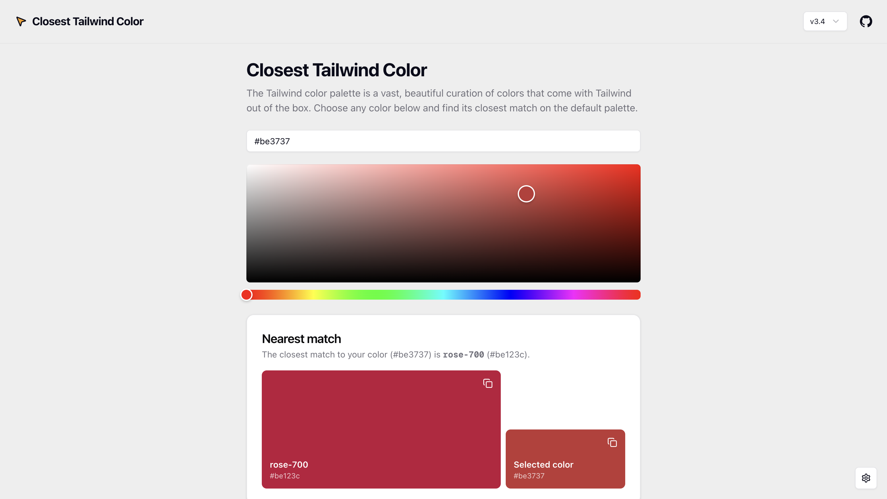

# 🎨 Closest Tailwind Color



A web application that helps you find the closest match on the default Tailwind CSS palette for any chosen color. Built with Next.js, React, and TypeScript.

## Features

- **Color Matching**: Find the closest Tailwind color for any hex color using Euclidean distance calculation
- **Multiple Tailwind Versions**: Support for both Tailwind CSS v3.4 and v4.0 color palettes
- **Interactive Color Picker**: Visual color picker with hex input support
- **OKLCH Support**: Display OKLCH color values for Tailwind v4 colors
- **Settings**: Toggle between Tailwind versions and include/exclude black and white colors
- **Copy to Clipboard**: Easy copying of color values with keyboard shortcuts
- **Responsive Design**: Works seamlessly on desktop and mobile devices

## Getting Started

First, install the dependencies:

```bash
npm install
# or
yarn install
# or
pnpm install
```

Then, run the development server:

```bash
npm run dev
# or
yarn dev
# or
pnpm dev
# or
bun dev
```

Open [http://localhost:3000](http://localhost:3000) with your browser to see the result.

## How It Works

The application uses a color matching algorithm that:

1. Converts hex colors to RGB values
2. Calculates the Euclidean distance between the input color and each Tailwind color
3. Returns the color with the smallest distance as the closest match

The color palettes are stored as JSON files containing all Tailwind colors with their hex values, and for v4, also includes OKLCH color space values.

## Tech Stack

- **Framework**: Next.js 15 with App Router
- **Language**: TypeScript
- **Styling**: Tailwind CSS v4
- **UI Components**: Radix UI primitives with custom styling
- **State Management**: Zustand with persistence
- **Color Picker**: react-colorful
- **Animations**: Framer Motion
- **Icons**: Lucide React

## Project Structure

```
src/
├── app/                 # Next.js app router pages
├── components/          # React components
│   ├── ui/             # Reusable UI components
│   ├── color-picker.tsx # Color picker component
│   ├── matchmaker.tsx   # Main color matching component
│   └── ...
├── hooks/              # Custom React hooks
├── lib/                # Utility functions and color matching logic
├── static/             # Tailwind color palette data
│   ├── v3/            # Tailwind v3 color data
│   └── v4/            # Tailwind v4 color data
└── stores/            # Zustand state stores
```

